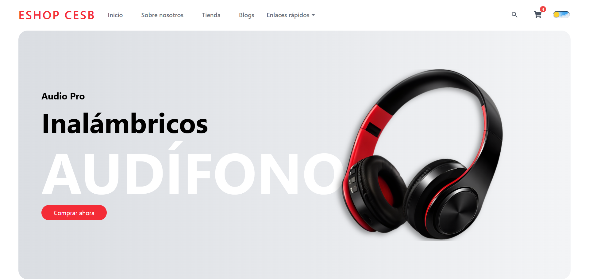

# ESHOP CESB 🚀

[](https://eshop-cesb.netlify.app/)

Bienvenido a **ESHOP CESB**, tu tienda en línea donde encontrarás la mejor selección de dispositivos tecnológicos diseñados para facilitar tu día a día. Desde smartphones y laptops de última generación hasta accesorios innovadores, ofrecemos productos de alta calidad con garantía y soporte confiable.

---

## 🌟 Características Principales

- Catálogo con los dispositivos más recientes. 💻
- Diseño moderno y fácil de usar. 🎨
- Interfaz completamente responsive. 📱
- Animaciones y transiciones fluidas. ✨
- Modo oscuro disponible para una mejor experiencia visual. 🌙

---

## ❓ ¿Por qué se llama ESHOP CESB?

El nombre **ESHOP CESB** no es solo una marca, sino una representación personal y auténtica. **CESB** son las iniciales de su creador, **Carlos Eduardo Silva Bustamante**, lo que refleja el compromiso directo con la calidad, la confianza y la atención al detalle en cada producto ofrecido.

Más allá de ser una simple tienda en línea, **ESHOP CESB** es un proyecto impulsado por la pasión por la tecnología y el deseo de brindar soluciones reales a las necesidades cotidianas. Cada artículo disponible ha sido cuidadosamente seleccionado para garantizar una experiencia de compra confiable y satisfactoria.

**ESHOP CESB** es, en esencia, la unión entre identidad personal y excelencia tecnológica.

---

## 🛠️ Tecnologías Usadas 👨‍💻

| HTML | CSS | JavaScript | React | Tailwind CSS | Vite | Node.js |
|------|-----|-----------|-------|-------------|------|---------|
|  |  |  |  |  |  |  |

---

## 📌 Instalación y Uso

1. Clona este repositorio:
   ```bash
   git clone https://github.com/carlozzsilva10/ecommerce-shop.git
   ```
2. Ve al directorio del proyecto:
   ```bash
   cd ecommerce-shop
   ```
3. Instala las dependencias:
   ```bash
   npm install
   ```
4. Inicia el servidor de desarrollo:
   ```bash
   npm run dev
   ```

---

## 📩 Contacto

Si tienes alguna pregunta o sugerencia, puedes encontrarme en:

- 🌐 [Mi GitHub](https://github.com/carlozzsilva10)
- 📧 Email: [carlozzsilva10@gmail.com](mailto:carlozzsilva10@gmail.com)
- 💼 [Mi LinkedIn](https://www.linkedin.com/in/carlos-eduardo-silva-bustamante-b6084528b?utm_source=share&utm_campaign=share_via&utm_content=profile&utm_medium=android_app)

---

📌 *ESHOP CESB - Tecnología al alcance de tus manos.*